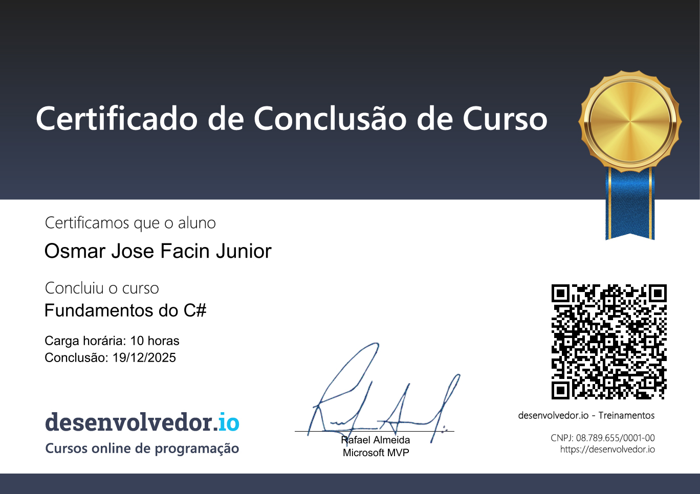

# Curso de Fundamentos de C#

Este repositório contém exemplos e exercícios do **Curso de Fundamentos do C#**, focado em conceitos básicos e intermediários da linguagem e da plataforma .NET.

## Conteúdo estudado

- **Variáveis** – tipos de valor e referência, declaração e inicialização
- **Funções (métodos)** – parâmetros, retorno, escopo, sobrecarga
- **Estruturas de dados** – arrays, listas e outras coleções básicas
- **Estruturas de controle** – `if/else`, `switch`, laços (`for`, `while`, `foreach`)
- **Classes e outros tipos** – classes, objetos, propriedades, construtores e enums
- **Conversão de valores** – conversões implícitas, explícitas e uso de métodos de conversão
- **Strings** – concatenação, interpolação, formatação e métodos mais comuns
- **Datas** – uso de `DateTime`, `TimeSpan` e formatação de datas
- **Exceptions** – tratamento de erros com `try/catch/finally` e criação de exceções
- **Arquivos** – leitura e escrita em arquivos de texto
- **LINQ** – consultas a coleções com operadores básicos (Where, Select, OrderBy, etc.)

## Projeto neste repositório

O diretório `CursoFundamentos.AppClientes` contém uma aplicação de console simples para praticar os conceitos do curso (como classes, arquivos e LINQ) em um contexto de cadastro de clientes.

## Como executar o projeto

1. Certifique-se de ter o **.NET SDK** instalado.
2. No terminal, na pasta raiz do repositório, execute:

	```bash
	dotnet run --project CursoFundamentos.AppClientes
	```

Isso irá compilar e executar a aplicação de console usada nas aulas.

## Certificado

Certificado de conclusão do curso de Fundamentos de C#:



---

Este repositório serve como material de apoio e prática para reforçar os fundamentos de C#.

